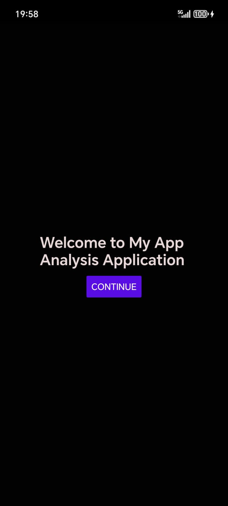

# MobDirStat - Android Storage Analysis App

MobDirStat is a **WinDirStat-like storage analysis tool** for Android, built using **React Native and Kotlin**. It scans and visualizes **app and media storage**, helping users understand how their device's storage is used and allowing them to manage it efficiently.

## Features 🚀

✅ **Analyze App & Media Storage** - Track storage usage for installed apps and media files.
✅ **Treemap Visualization** - Interactive storage map for better insights (apps and media visualized separately).
✅ **Open & Manage Apps** - Click an app to access its settings and uninstall if needed.
✅ **Open Media Files** - Click media files to open them directly in the gallery.
✅ **Caching & Performance Optimization** - Future updates may store analyzed data for faster access.

## Screenshots 📸  

<details>
  <summary>Details</summary>  

Click to view welcome screen and permissions:  
-   
-   
-  **Select MobDirStat then grant**  

### **Phone Overview**  
Overview of the entire phone's storage system:  
-   

### **Tabs**  
- **Apps Tab**:   
- **Media Tab**:   

### **Selected App & Settings**  
- **Selected App**:   
- **Click Go to Settings**:   

</details>


## Installation 📲

### **1. Download the APK**

Grab the latest APK from the **[Releases](https://github.com/O-ElAli/MobDirStat/releases)** page.

### **2. Install on Your Device**

- Open the downloaded APK.
- If prompted, allow installation from unknown sources.
- Install and start analyzing your storage!

## Usage 💡

1. **Launch the App** - The home screen will display an overview of your storage.
2. **Provide Permissions** - Ensure the app has the necessary storage permissions for accurate analysis.
3. **View App Analysis** - Navigate to the **Apps tab** to see how much space apps are using.
4. **View Media Storage** - Open the **Media tab** to check media file usage.
5. **Interact with Treemap** - Tap on **apps or media** in the visualization to get more options.
6. **Manage Storage** - Click an app to open its settings or a media file to view it.

## Technical Details 🛠️

- **Frontend:** React Native (JavaScript/TypeScript)
- **Backend:** Native Android (Kotlin)
- **Visualization:** Custom-built treemap using D3.js and other supporting libraries.
- **Permissions:** Requires access to storage for analysis.
- **Performance Considerations:** Implemented optimizations to ensure smooth performance when handling large storage scans.

## Development Setup 🏗️

### **1. Clone the Repository**

```bash
 git clone https://github.com/O-ElAli/MobDirStat.git
 cd MobDirStat
```

### **2. Install Dependencies**

```bash
 npm install  # or yarn install
```

### **3. Run the App**

Start the development server:
```bash
 npx react-native start
```

For Android:
```bash
 npx react-native run-android
```

For iOS (if applicable, planned for future updates):
```bash
 npx react-native run-ios
```

*(Ensure you have an Android emulator or a physical device connected.)*

## Future Improvements 🚧

🔹 **Add Database Caching** - Store previous scans for faster analysis.
🔹 **Improve UI/UX** - Enhance the app’s design and user experience.
🔹 **Support More File Types** - Expand media analysis capabilities.
🔹 **Add Storage Cleaning Options** - Suggest deletions for large or unused files.
🔹 **iOS Version** - Future updates will include an iOS version.

## 📜 Required Permissions 🔑  

The app requires the following permissions to function properly:  

### **Storage & Media Access**  
- **`android.permission.READ_MEDIA_IMAGES`** – Allows reading image files stored on the device.  
- **`android.permission.READ_MEDIA_VIDEO`** – Grants access to video files for analysis.  
- **`android.permission.READ_MEDIA_AUDIO`** – Enables reading audio files to assess storage usage.  
- **`android.permission.READ_EXTERNAL_STORAGE`** – Provides access to external storage for analyzing stored files. *(Required for compatibility with older Android versions.)*  
- **`android.permission.MANAGE_EXTERNAL_STORAGE`** – *(Android 11+)* Grants full access to manage external storage, allowing in-depth analysis of files and apps.  

### **App Data & Package Analysis**  
- **`android.permission.QUERY_ALL_PACKAGES`** – Allows retrieving a list of all installed applications on the device, essential for analyzing app storage usage.  
- **`android.permission.GET_PACKAGE_SIZE`** – Enables fetching storage details of each installed app, including cache and data usage.  
- **`android.permission.PACKAGE_USAGE_STATS`** *(Usage Access Required)* – Grants access to app usage statistics, which may be necessary for advanced analysis. *(This permission must be manually enabled by the user in system settings.)*  


These permissions are necessary to retrieve storage information and display an accurate visualization of app and media usage.

## Contributing 🤝

Want to contribute? Here’s how:

1. Fork the repository.
2. Create a new branch (`feature-branch-name`).
3. Commit your changes (`git commit -m 'Added new feature'`).
4. Push to the branch (`git push origin feature-branch-name`).
5. Open a Pull Request.

## License 📜

This project is licensed under the **MIT License** - see the [`LICENSE`](LICENSE) file for details.

---

⭐ **If you find this project useful, don't forget to star the repo!** ⭐

